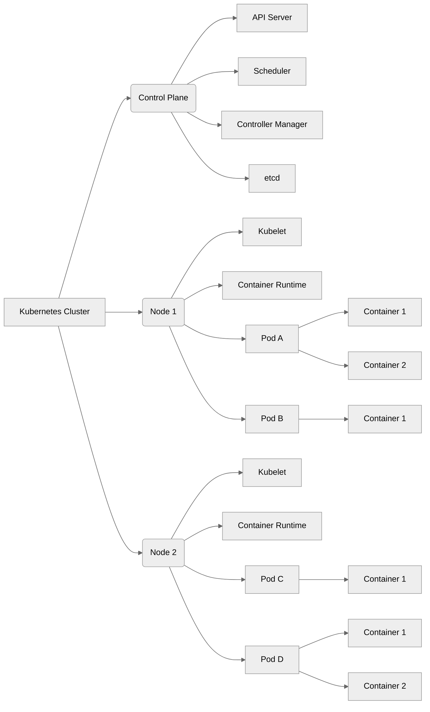

Last year, Kubernetes officially dropped support for Docker as a container runtime in **v1.27**. If you're still trying to wrap your head around what that means—or you're just getting started with Kubernetes—this one's for you.

With mastering basics of Kubernetes no longer optional - setting up a cluster, deploying applications, and managing rollbacks? That still feels daunting to many.

Here's what you need to know:

→ Kubernetes now uses containerd (a Docker shim) instead of Docker runtime—leaner, faster, and purpose-built for orchestration.

→ You can launch a local cluster in minutes using tools like Colima + Minikube.

→ Deploy real workloads like NGINX, expose them via NodePort services, and test the live URLs—all from your terminal.

→ Simulate failure (yes, intentionally), and learn how to roll back deployments gracefully using native kubectl commands.

→ **The best part?** You’ll observe how Kubernetes manages health, state, and traffic, giving you hands-on insight into its declarative power.

This tutorial is your **Zero→One** Kubernetes lab environment.

📘 Dive into the full blog now and level up your DevOps roadmap with Kubernetes → https://medium.com/msackiit/the-devops-roadmap-kubernetes-0f851278c7be

