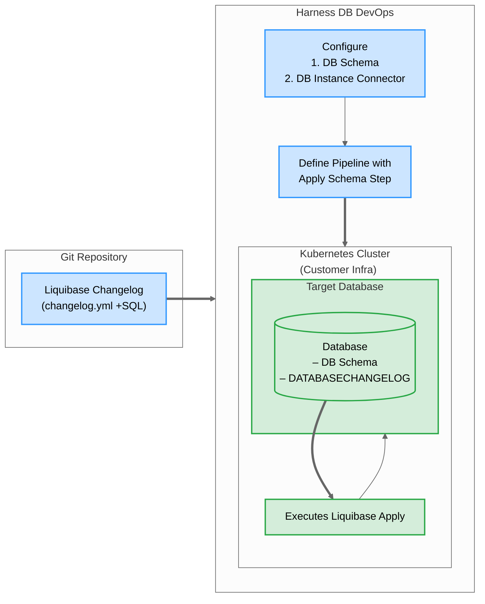

# QuickStart Guide
Welcome to the Harness Database DevOps (DB DevOps) onboarding guide. This guide introduces you to the robust capabilities of Harness DB DevOps, providing a streamlined approach to managing and securing your database operations. 

When you define a pipeline in Harness DB DevOps, we dynamically orchestrate a series of jobs within your Kubernetes cluster. These jobs are responsible for cloning your Liquibase changelogs from Git, applying schema changes using Liquibase, and managing logs and cleanup post-execution. This operational logic is abstracted from the end-user — you define the intent, we manage the execution.




## Prerequisites

Before beginning the walkthroughs in this guide, ensure you have:


| Item | Details / Link |
| ---- | ---- |
|Harness account | Database DevOps Feature flag enabled (see “[Enabling Feature Flags](https://developer.harness.io/docs/database-devops/dbdevops-supported-platforms/)”) |
| Kubernetes cluster | Cluster ≥ v1.18, Harness Delegate installed ([Delegate setup guide](https://developer.harness.io/docs/platform/delegates/install-delegates/overview/))|
| Database credentials | JDBC‑compatible database; user with DDL/DML privileges |


## Setting Database DevOps
### 1. Create a Liquibase changelog

> **Note**: If you already use liquibase, you can skip to the section `Configuring Your DB Schema`.

1. Create Git Repo to store your DB schema files.
2. Under repo, create folder sql/ and add ordered *.sql files
3. Add changelog.yml at root with:

```yaml
databaseChangeLog:
  - includeAll:
      path: sql
```
> **Tip**: Use semantic file names ("V1__init.sql", "V2__add_table.sql").

### 2. Configure your Database Schema 
1. On the module picker, choose `DB DevOps` in your harness account.


2. In the left hand nav, choose `DB Schemas` and Click `Add New DB Schema`.


  - **Name** - A Schema Name to identify the database configuration.
  - **Connector** - Code Repositories hosted on either GitHub, Azure, GitLab, BitBucket or etc..

### 3. Connect with Database Instance
Before we can deploy our Database Schema, we need to connect a database instance to which we can deploy it. Here’s how:

1. Under "DB Instances", click  "Add New DB Instance".
2. Select main (or your environment branch).
3. Click New Connector and Enter Name, JDBC URL & credentials, select the harness delegate, then Save and Finish. Learn more [here](https://developer.harness.io/docs/database-devops/use-database-devops/set-up-connectors/)
4. Click Add Database Instance.

### 4. Configure your Deployment Pipeline
A deployment pipeline deploys your database changes when it runs. In addition to deploying your database, it can also deploy application changes, and have other logic such as requiring a manual approval. Here are some steps on how to create a simple pipeline that deploys a schema change to a database instance anytime it changes in git:

1. Under Pipelines, Click `Create a Pipeline`.
2. Click on Add Stage and Choose `Custom stage`.
3. Choose Add step group and Turn on `Enable Containerized Stage`.
4. Choose the Kubernetes cluster you'd like to run on.
5. Click Add Step and Choose the `Apply Database Schema` step under DB DevOps.
6. For the step name, enter "Deploy Database Schema".


  - **Name**: Name of the step, by default the name is "DBSchemaApply_1". 
  - **Timeout**: The timeout limit is the maximum allowable time a stage or pipeline can run.
  - **Select DB Schema**: The DB Schema we created on Step 2.
  - **Select DB Instance**: The Instance we created on Step 3.
  - **Tag (Optional)**: You can add custom tags to each deployment. In case it is left empty, harness will add the tag during the deployment.
7. Click `Apply Changes` and Save the Pipeline.
8. Now, click on "Run" and wait for your pipeline to complete.


